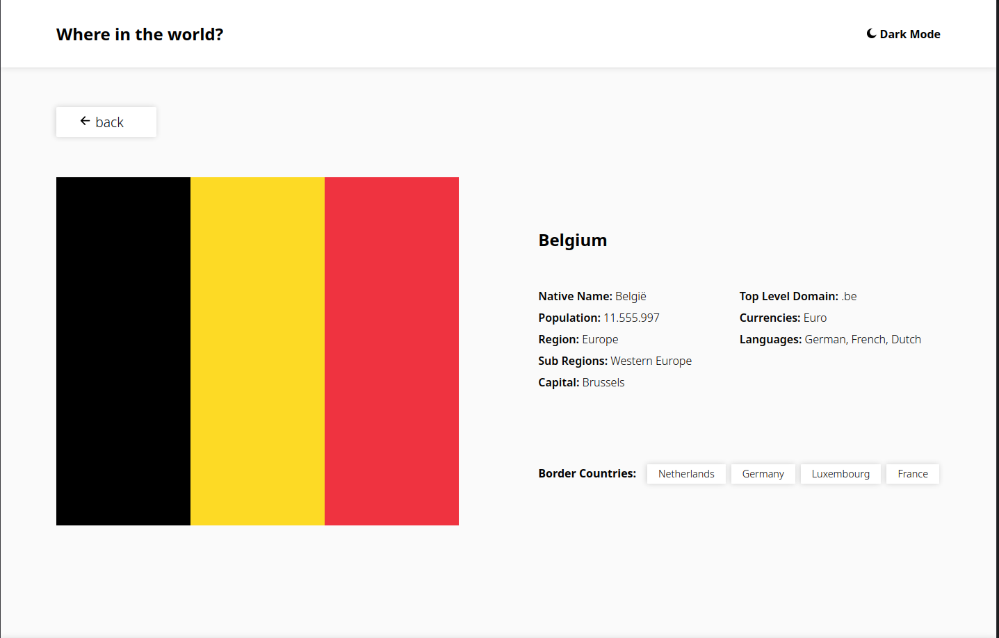

# Frontend Mentor - REST Countries API with color theme switcher solution

This is a solution to the [REST Countries API with color theme switcher challenge on Frontend Mentor](https://www.frontendmentor.io/challenges/rest-countries-api-with-color-theme-switcher-5cacc469fec04111f7b848ca).

## Table of contents

- [Overview](#overview)
  - [The challenge](#the-challenge)
  - [Screenshot](#screenshot)
  - [Links](#links)
  - [Built with](#built-with)
  - [What I learned](#what-i-learned)

### The challenge

Users should be able to:

- See all countries from the API on the homepage
- Search for a country using an `input` field
- Filter countries by region
- Click on a country to see more detailed information on a separate page
- Click through to the border countries on the detail page
- Toggle the color scheme between light and dark mode *(optional)* (done)

### Screenshot

#### Phone


#### Desktop



### Links

- Solution URL: [Add solution URL here](https://github.com/ScarletPixie/country-info)
- Live Site URL: [Add live site URL here](https://scarletpixie.github.io/country-info/)

### Built with

- Semantic HTML5 markup
- CSS custom properties
- Flexbox
- CSS Grid
- Acessibility in Mind

### What i learned
Cookies and Javascript event throttle using closures:
```javascript
function switchTheme(switchDelayMs)
{
	let mode = 0;
	let timer = null;
	if (!document.cookie)
	{
		document.cookie = `theme=${(window.matchMedia('(prefers-color-scheme: dark)').matches) ? 'dark' : 'light'}; SameSite=Lax; Secure; max-age=315360000`; // 10 years
	}

	mode = (document.cookie.split('=')[1] === 'dark') ? 1 : 0;

	const setThemes = [lightTheme, darkTheme];

	return () => {
		if (timer)
			return;
		timer = setTimeout(() => { timer = null; }, switchDelayMs);
		mode = Number(!mode);
		setThemes[mode]();
		document.cookie = `theme=${mode ? 'dark' : 'light'}; SameSite=Lax; Secure;`;
	};
}
```
Some basic accessibility concepts like aria labels, accessibility tree.